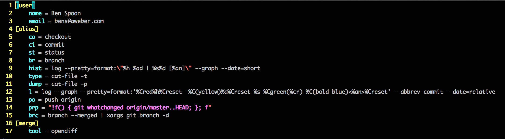
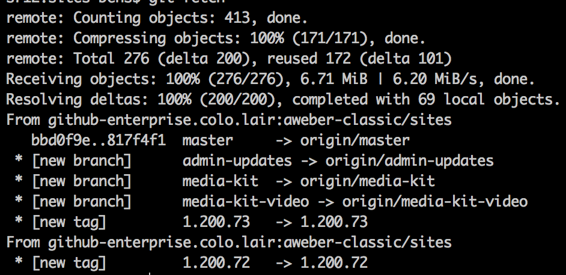
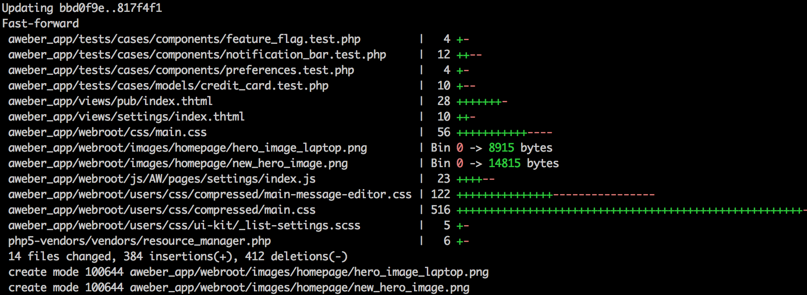
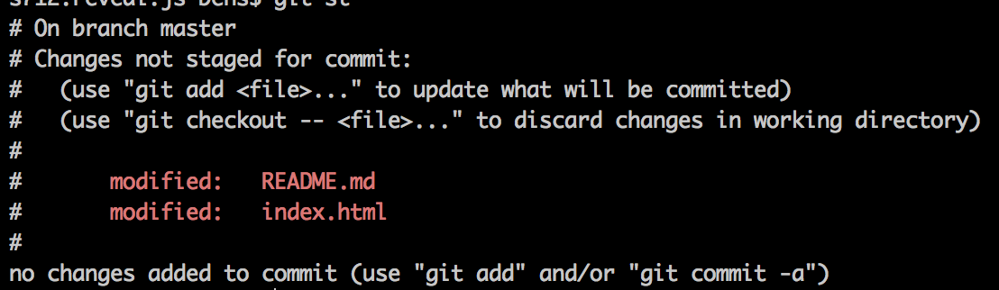
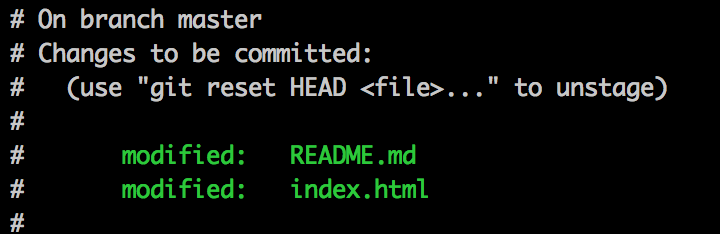
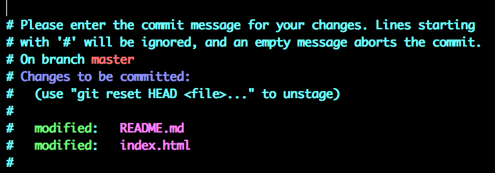
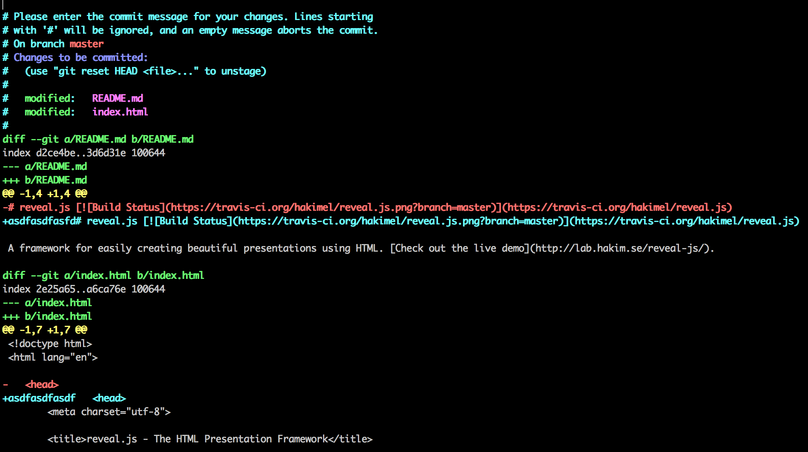

# Git 101
Ben Spoon


## It's Simple

**_ Trust me. _**


## Here is some stuff
* fetch 
* pull 
* add 
* commit  
* branch 
* stash
* checkout 
* reset  
* rebase  
* status


## Setup
Before the basics
```
$ git config --global -e 

```



## User
Let git know who you are
```text
[user]
   name = Ben Spoon
   email = bens@aweber.com  
```
Optionally... 

```bash
$ git config --global user.name "Ben Spoon"
```


## Alias
```
[alias]
       co = checkout
       ci = commit
       st = status
       br = branch
       hist = log --pretty=format:\"%h %ad | %s%d [%an]\" --graph --date=short"
       type = cat-file -t
       dump = cat-file -p
       l = log --graph --pretty=format:'%Cred%h%Creset -%C(yellow)%d%Creset %s %Cgreen(%cr) C(bold blue)<%an>%Creset' --abbrev-commit --date=relative
       po = push origin
       prp = "!f() { git whatchanged origin/master..HEAD; }; f"
       brc = branch --merged | xargs git branch -d
```


## Merge
If you don't like to use your IDE
```
[merge]
   tool = opendiff
```


## Copy Pasta
https://gist.github.com/spoonben/10420500


## Every day use

Stuff you'll run into ** a lot **

   


## git fetch
```
$ git fetch 
```

Gets the latest branches


## git pull 
```
$ git pull
```

Gets the latest commits


## git status
```
$ git status
```

What's changes since the last commit?


## git stash
```
$ git stash
$ git stash apply
$ git stash pop
$ git stash list
```
Useful when 

* Switching between branches
* Unsure changes


## git add 
```
$ git add index.html
$ git add .
```


Adds current changes to staging


## git commit 
``` 
$ git commit 
```



## git commit (verbose)
```bash
$ git commit -v 
```
Shows you your changes



## git commit (w/ message)
```bash
$ git commit -m 'This is your message!'
```
Appends a message inline without going into an editor

### but @ AWeber
and Generally 

**_DON'T DO THIS_**


## commiting with intent
Just think: "_This commit intends to_"


## commit often
* Just like saving your work
* When it makes sense
* WIP are okay - but rebase later


# Question Time


# Next Time: 
## Rebasing