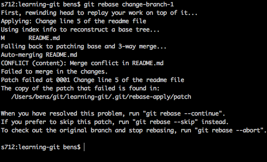
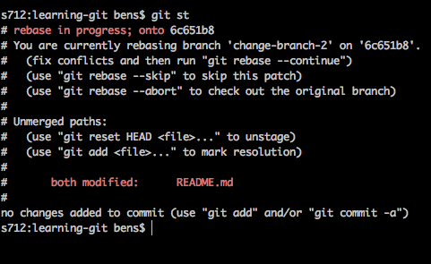
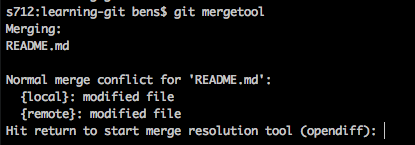
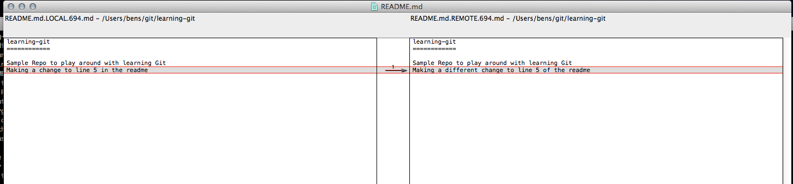
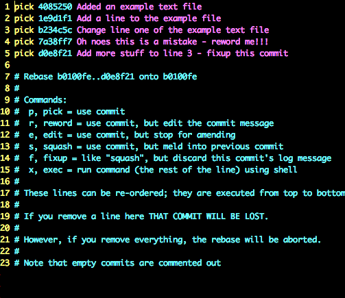

# Git 101
Ben Spoon


## git rebase
Make it clean


## Big Question:
### What does it do?


 * Integrate changes from one file to another
 * Edit your commits (interactive rebase) 
 * Makes life complicated
 * Makes reviewing easier


## Basic use
```bash
$ git rebase master
```


But unfortunetly 80% of the time that won't work


## So here's what you'll see


Pay attention to "CONFLICT"


## What file(s) have the conflict? 
```bash
$ git status
```




## Open those files
```bash	
Sample Repo to play around with learning Git
<<<<<<< HEAD
Making a change to line 5 in the readme
=======
Making a different change to line 5 of the readme
>>>>>>> Change line 5 of the readme file
```


## Or use mergetool
```bash
$ git mergetool
```


Just hit enter




You'll see opendiff 

(see git 101)



## git rebase (interactive)
```bash 
$ git rebase -i master
```


Lots of options




## Pick (p)
"Use commit"

* Wherever it may be.. 
* Default option


## Reword (r)
"Use commit, but edit the commit message"

* Spelling mistakes
* Change of functionality


## Edit (e)
"use commit, but stop for amending"

* Stop the rebase at this commit
* Edit the files and ammend 
* Break into seperate commits 
* _**Really**_ useful


## Squash (s)
"use commit, but meld into previous commit"

* Basically merge commits
* Merge commit messages


## Fixup (f)
"like 'squash', but discard this commit's log message'"

* Keep work done, and put it in the commit above it
* I like it better than sqaush


## Exec (x)
"run command (the rest of the line) using shell"

* Run something like make or rake commands
* Never really used it 


## Lets do something
https://github.com/spoonben/learning-git


# Question Time


# More useful things
(That are not git rebase)

[Git Tips PDF](https://github.com/spoonben/learning-git/blob/master/bens-GitTips!-110414-1133-28.pdf?raw=true)


# Next time: 
## Q&A - Workshop