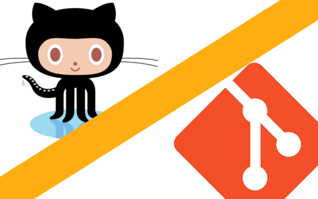
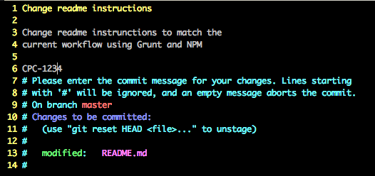
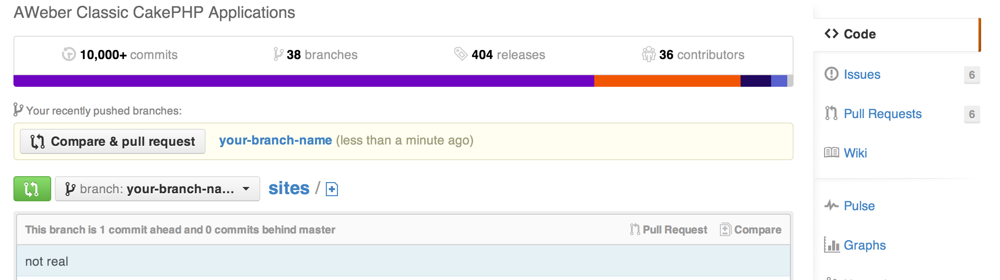

# Intro To Git
### A distributed version control system
#### Ben Spoon


## Git Vs. Github



## So basically, trees.


## Branches
* Master - your default branch after clone 
  * The Trunk of the tree
  * Origin/Master - the main branch (live code)
* Feature Branch - your work
  * A Branch of the tree


## Staging and Committing 
* **Stage** - "Okay, I'm all done with this change, but I probably shouldn't record it to my branch yet; it still needs something else."
	* ```bash
	$ git add your_file_name.php
	```
* **Commit** - "THIS IS GREAT! All my changes are ready, let's record them!"
	* ```bash
	$ git commit
	```
	


## Commit Messages
* present tense imperative
	* Just think: "this commit intends to..." 
* first line is a short subject (50 characters or less)
* next few lines are a longer description
* include JIRA ticket number in body (e.g. EE-100)

Looks something like..


## This



## Pushing Your Changes
```
$ git push origin your-branch-name
```


## Making a Pull Request (PR)



## Making a Pull Request (PR)
* Concise title
* Descriptive... description 
* Instructions on how to test, when appropriate 


## Code review
* Address feedback
* Add and commit revisions 
* Make sure to let the reviewer know


## DON'T MERGE YOUR OWN CODE
Just don't do it. 


## Useful Commands
* pull
* push
* fetch
* log
* commit
* add
* reset
* reflog
* rebase
* status


# Questions?