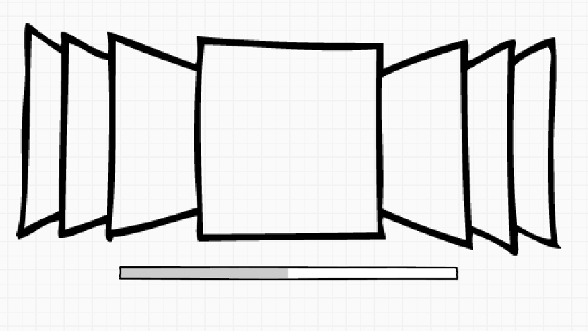
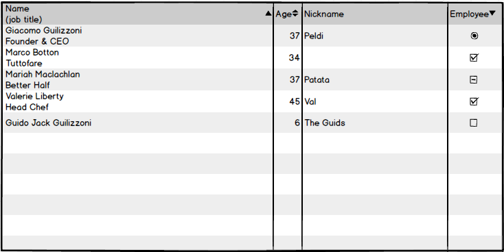

#JavaScript
Ben Spoon


## What is JavaScript?


### One of the most popular programming language in the world!



### Let users interact



### Manipulate data


## So why do we use it?
* Easy to implement
* Works on all platforms
* AJAX - loading data without ever leaving the page
* Let's users interact with your page


### Flavors


### Vanilla


Regular, plain vanilla, JavaScript

http://vanilla-js.com/


### Server Side JavaScript


* Node.js - The latest server side JavaScript solution
* LiveWire - Older server side JavaScript framework
* Silk.js - server side script ran off Google's V8 engine
* MongoDB - Database
* [Many More](http://en.wikipedia.org/wiki/Comparison_of_server-side_JavaScript_solutions)


### Libraries


Ways to write and organize JavaScript


Short hand JavaScript, one of the most popular libraries

(we'll get into this later)


## The Basics();


### __Using Script Blocks__
Creates a client side script block (usually JavaScript)

```html
<script type="text/javascript">
	function doStuff() {
	 	alert('This alerts a thing');
	}
</ script>
```

*	Only executable on the page you are currently on
*	Just like internal CSS blocks


### __Using External Scripts__
Files managed outside of the HTML you are on

```html
<script src="yourfile.js" type="text/javascript"></ script>
```

*	Often used when you want to include something on several pages
*	Works just like external style sheets


### __JavaScript on HTML elements__
Vanilla JavaScript way of making an HTML element execute a piece of script

```html
<input type="button" onClick="someFunction()" value="Click Me!"/>
```
```javascript
function someFunction(e) {
	e.preventDefault();
	alert('something!')
}
```


## Basic Syntax


### __Strings__
Strings are text.
```javascript
'Single Quotes'
```
 or 
 ```javascript
 "Double Quotes"
 ```
"Doesn't matter just be consistant." 


### __Variables__
Otherwise known as "vars"

Stores something in memory (data values)
```javascript
var a = "Something"
var b = 13
var c = "13"
var d = {};
var e = [];
```


### __Concatination__
Putting mutiple strings together
<br/>
```javascript
"This sting" + variableString + "another string."
```


### __Operators__
Strings, math, all sorts

* Assignment

```javascript
var a = "a"; 
```

* Arithmetic (math)

```javascript
var c = ((a + b) * 5)/2   
```
* Conditional 

```javascript
if (a == b) {}
if (a != b) {}
if (a < b) {}
``` 


### __Reserved Words__
Reserved words used by javascript

_(Don't use these for variables)_

* this
* var
* return
* alert
* For a full list go here [W3 Schools](http://www.w3schools.com/js/js_reserved.asp)


### __Comments__
Things that won't affect your code

```javascript
// This won't get read by the browser, and is a single line
var code = "something";
/* 
 * This is a multi-line
 * comment.
 */
```


# Questions so far?


## Okay, let's talk functions


### __Defining Functions__
Functions are reusable blocks of code

```javascript
function doSomething(passedIn){
	alert('This ' + thing);
}
```

* This is the __function definition__
* __doSomething__ is the __function name__
* the parenthesis __()__ hold the __arguments__ passed in
* __passedIn__ _is_ the variable you passed in


### __Calling Functions__
When you want to use a function, you call it
```
var name = 'Ben';
doSomething(name);
```


### __Objects__
Most things in JavaScript, that we use, are objects.

```javascript
var person = {
	firstName : "Ben"
	lastName : "Spoon"
};
```
